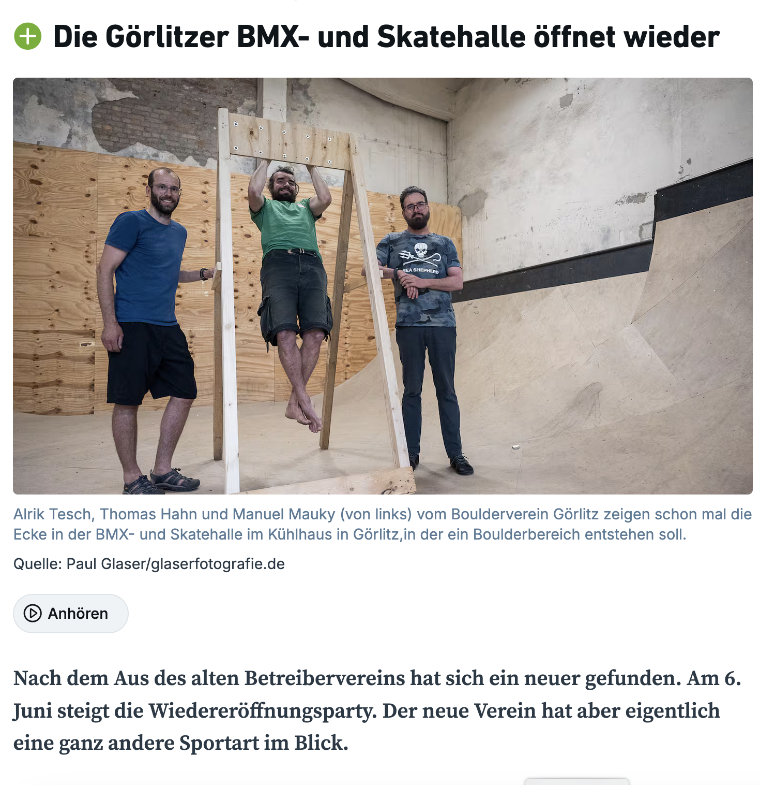

Die Sächsische Zeitung hat mit uns über die Wiederbelebung der BMX- und Skatehalle im Kühlhaus und unsere Pläne für
einen Boulderbereich gesprochen.

[Link zum Artikel](https://www.saechsische.de/lokales/goerlitz-lk/goerlitz/goerlitz-bmx-und-skatehalle-oeffnet-am-6-juni-wieder-mit-neuem-betreiber-XHRJDTST4ZHRZPA62BGVN6SJHM.html)
