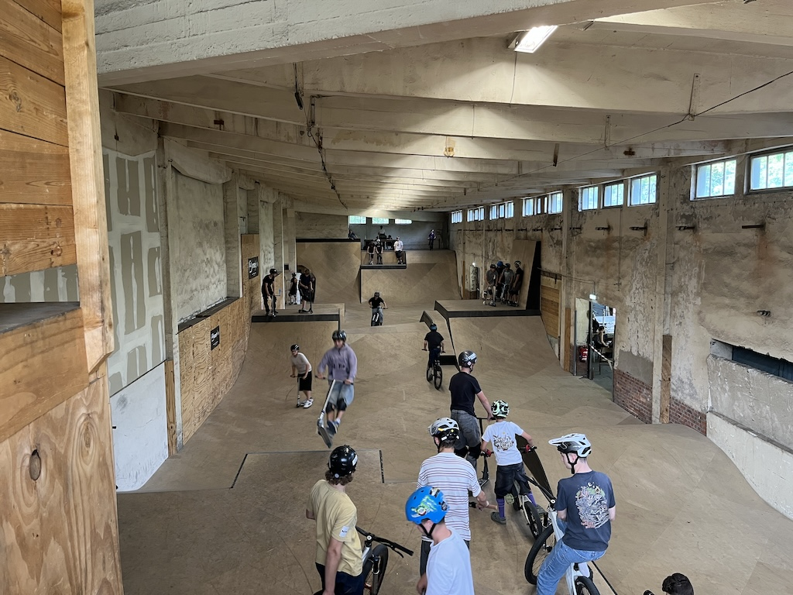
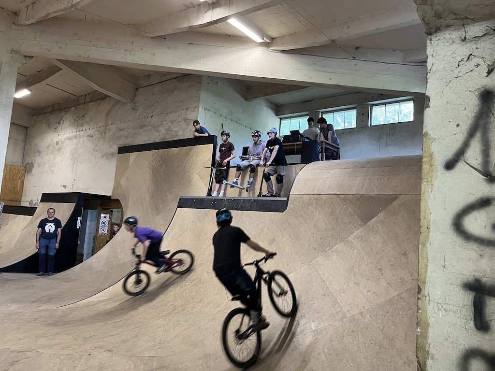
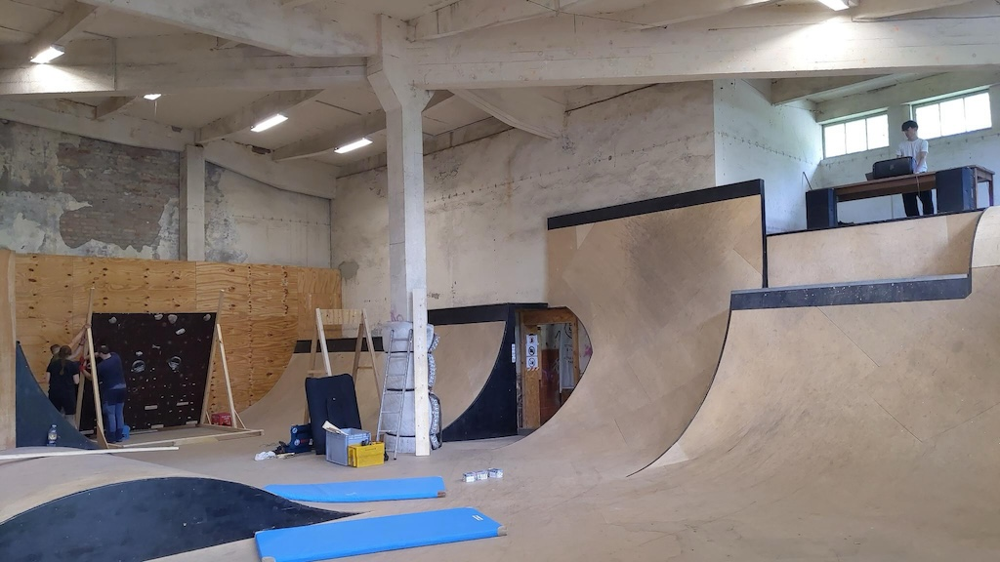

Am 06. Juni haben wir zur Eröffnungsfeier unserer neuen BMX-, Skate- und Boulderhalle eingeladen
und haben uns sehr über das große Interesse und die vielen Menschen gefreut, die uns besucht haben.

Vor allem haben wir uns natürlich über den großen Andrang an Kindern und Jugendlichen gefreut,
die endlich wieder in der Halle fahren konnten. Knapp 70 junge Leute haben das Angebot genutzt.

Dank einiger Vereinsmitglieder konnten wir sogar eine kleine Bouldermöglichkeit in Form einer mobilen
Boulderwand anbieten. Diese wurde in den Tagen vor der Veranstaltung selbst gebaut und noch vor Ort
mit Griffen ausgestattet.

Gefreut haben wir uns auch über die vielen guten Gespräche und das positive Feedback von Leuten,
die sich für das Bouldern interessieren. Der Grundtenor war: "Schön, dass wieder etwas passiert in Görlitz".

Nach der Eröffnung wollen wir nun wieder regelmäßig die Halle fürs Skaten und BMX-Fahren öffnen.
Da wir aber ein rein ehrenamtlich arbeitender Verein sind, können wir aktuell noch keine fixen Öffnungszeiten
garantieren. Wann die Halle geöffnet ist, erfahrt ihr unter [Öffnungszeiten](/opening-hours).

Natürlich werden wir nun auch mit dem Bau der Boulderwand beginnen und hoffen, möglichst bald auch 
Bouldern anbieten zu können.

Für all dies brauchen wir aber auch weiterhin eure Unterstützung. 
Zum Einen würden wir uns riesig über eure finanzielle Unterstützung freuen um den Bau der Boulderwand zu finanzieren.
Vor allem freuen wir uns aber über helfende Hände und Menschen, die unserem Verein beitreten und 
aktiv mithelfen möchten.
Wie ihr uns unterstützen könnt, erfahrt ihr unter [Mitmachen und Unterstützen](/mitmachen). 

